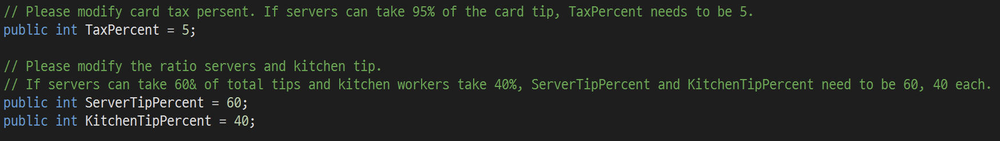
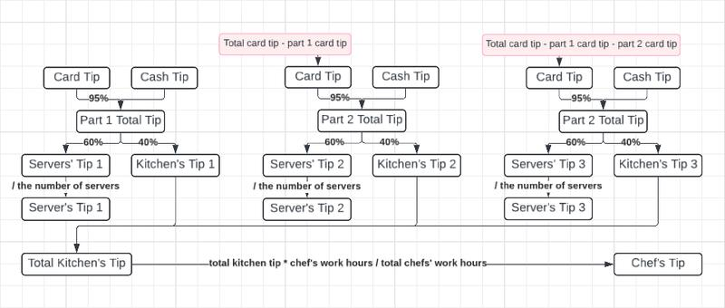
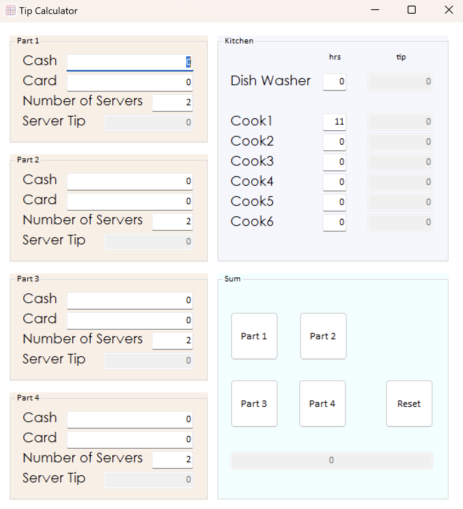

<H1>Tip Calculator</H1>
This application is made for <strong>The Famous Owl of Minerva</strong> to calculate tips.

<h3>Introduction</h3>
This application is made via C# Windows Forms.
If you want to install the app on your computer, download the <strong>setup.exe</strong> file.

<h3>Development Guide</h3>
1. Download Visual Studio on your computer (Windows ONLY)  
2. Modify the percentage of the tax, server's tip and kitchen's tip. 

3. Run the program

<h3>Screenshots</h3>
You can see how the tip is calculated with this chart. 

If you run or download the program, you can see this screen. 

<h3>Demo</h3>
You can watch the demo video here!  <a href="https://drive.google.com/file/d/115LefJ6f5BESvEeZrR3p-vLnDd_b-H5q/view?usp=sharing">Click here!</a>
